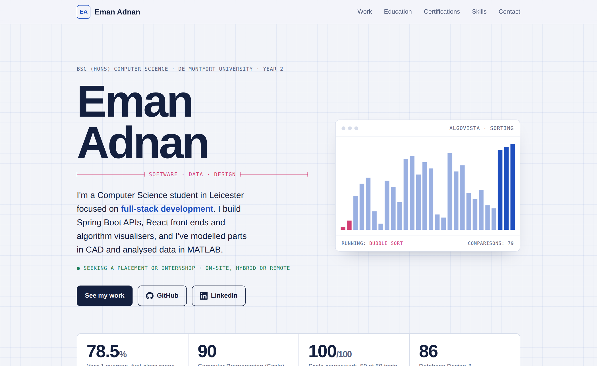

<div align="center">

# Eman Adnan · Portfolio 💻

**BSc (Hons) Computer Science student at De Montfort University, focused on full-stack development**

I build Spring Boot APIs, React front ends and algorithm visualisers, and I've modelled parts in CAD and analysed data in MATLAB.

[](https://emanadnann.github.io/eman-portfolio/index_1.html)
[](https://www.linkedin.com/in/emanadnan1212/)
[](https://algo-vista-three.vercel.app)

🟢 **Open to placements and internships** · Leicester, UK · on-site, hybrid or remote

</div>

---

## ⭐ New Portfolio (2026)

[](https://emanadnann.github.io/eman-portfolio/index_1.html)

<p align="center"><b><a href="https://emanadnann.github.io/eman-portfolio/index_1.html">👉 Open the live portfolio</a></b></p>

A single-page portfolio built from scratch in **HTML, CSS and JavaScript**, with no frameworks or templates. The design is based on engineering drawings, with a grid-paper background, dimension lines and a "title block" on every project.

### ✨ What makes it different

- **Live algorithm animation:** the hero runs Bubble, Quick and Merge Sort in real time on a `<canvas>`
- **Interactive A\* pathfinding grid:** click "Run A*" and watch it explore the grid and find the shortest path
- **Real data charts:** my MATLAB student absences dataset redrawn as switchable scatter, bar and box plots in SVG
- **Light and dark mode:** follows your system setting, with a blueprint look in dark mode
- **Works on any screen:** responsive layout from phone to desktop
- **Accessible:** keyboard focus states, and animations stop if you prefer reduced motion

### 📊 At a glance

| 78.5% | 90 | 100/100 | 86 |
|:---:|:---:|:---:|:---:|
| Year 1 average (first-class range) | Computer Programming (Scala) | Scala coursework, 50/50 tests passing | Database Design & Implementation |

### 🗂 Projects featured

| Project | Tech | Links |
|---|---|---|
| **AlgoVista**: sorting and pathfinding visualiser | React · Vite · JavaScript | [Live demo](https://algo-vista-three.vercel.app) · [Code](https://github.com/emanadnann/AlgoVista) |
| **Task Manager REST API** with JWT auth | Java · Spring Boot · Spring Security · JPA | [Code](https://github.com/emanadnann/taskmanager-api) |
| **Ocean Salvage Game** (100/100) | Scala · JUnit | [Code](https://github.com/emanadnann/CTEC1703-Game) |
| **Student Absences Analyser** | MATLAB · App Designer | In portfolio |
| **Table Assembly** | Creo Parametric CAD | In portfolio |
| **Heart of Stationery** e-commerce shop | Wix Studio · team of 3 | [Live site](https://pikapikanan30.wixstudio.com/stationeryshop) |
| **Social Media Research Blog** | Primary research · Blogger | [Blog](https://emanadnansocialmedia.blogspot.com) |

### 🎓 Certifications

Google Data Analytics Professional Certificate · HackerRank Software Engineer Intern · HackerRank SQL (Advanced) · freeCodeCamp Python

---

## 🌟 My First Portfolio (2025)

[](https://developer.mozilla.org/en-US/docs/Web/HTML) 
[](https://developer.mozilla.org/en-US/docs/Web/CSS) 
[](https://developer.mozilla.org/en-US/docs/Web/JavaScript)  

This repository also keeps my **first professional portfolio website**, built using **HTML, CSS, and JavaScript**. It shows where I started, and highlights my skills in **frontend development, responsive design, and interactivity**.

**View Live:** [Click Here](https://emanadnann.github.io/eman-portfolio/)

### 📂 Projects Included
#### Portfolio Website
- My first professional portfolio website.
- Highlights interactive and responsive web design.  

#### Interactive Web Project
- A small project demonstrating modern web development skills using JavaScript.

### 🖼 Screenshots
- [Homepage Screenshot](homepage.png)
- [Projects Section Screenshot](homepage.png2.png)

---

## 📁 Folder Structure
```text
eman-portfolio/
├── index_1.html           # ⭐ New portfolio (2026)
├── portfolio-preview.png  # Preview image of the new portfolio
├── index.html             # First portfolio (2025)
├── style.css              # Styles for the first portfolio
├── script.js              # Interactivity for the first portfolio
├── homepage.png           # Screenshots of the first portfolio
├── homepage.png2.png
└── README.md              # You are here
```

---

## ⚡ Skills Demonstrated
- Frontend development with HTML, CSS and JavaScript (no frameworks)
- Canvas and SVG graphics, animation and algorithm implementation (sorting, A*)
- Responsive, accessible UI design with light and dark themes
- Project organisation and documentation

---

## 🌐 Connect With Me
- [LinkedIn](https://www.linkedin.com/in/emanadnan1212/)  
- [GitHub](https://github.com/emanadnann)  
- [Email](mailto:emana12098@gmail.com)

